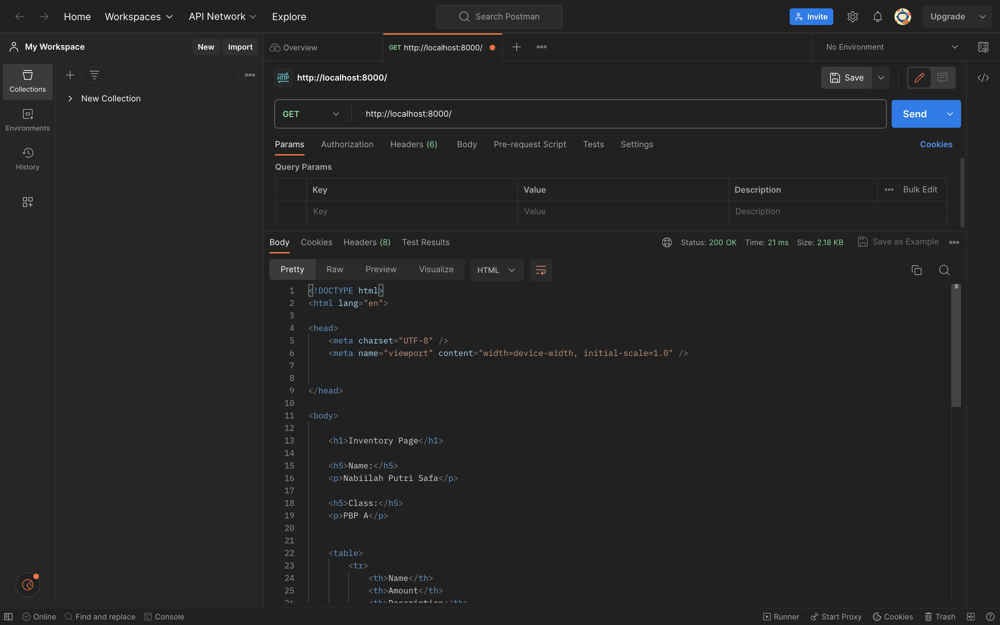
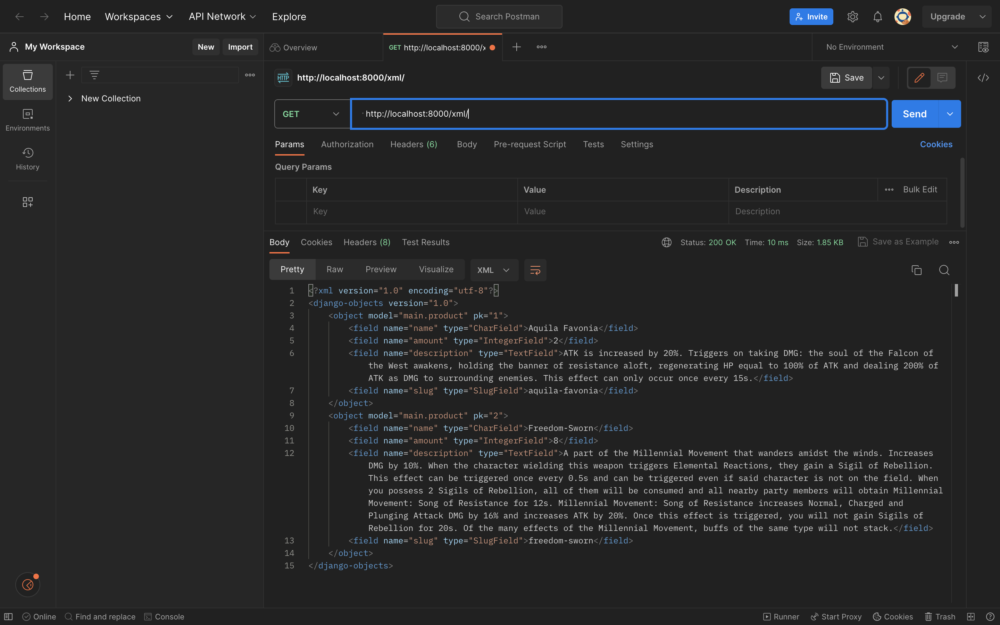
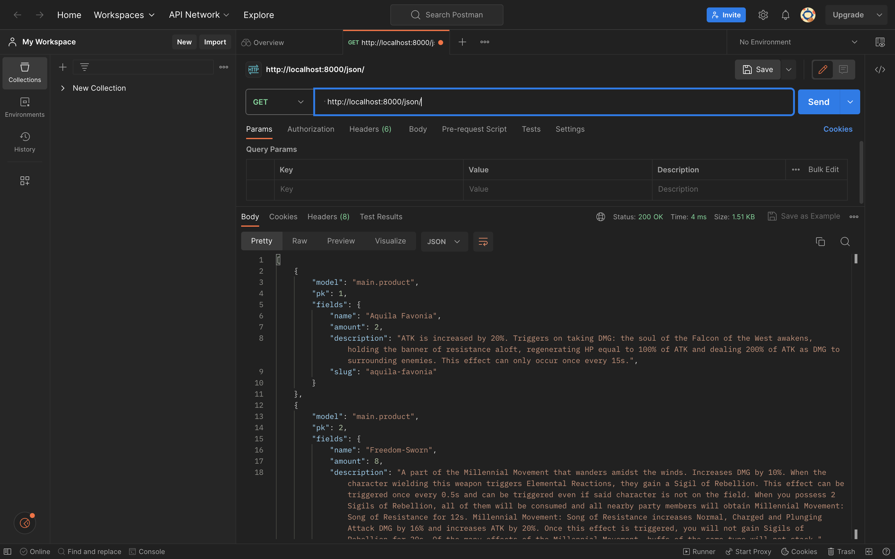
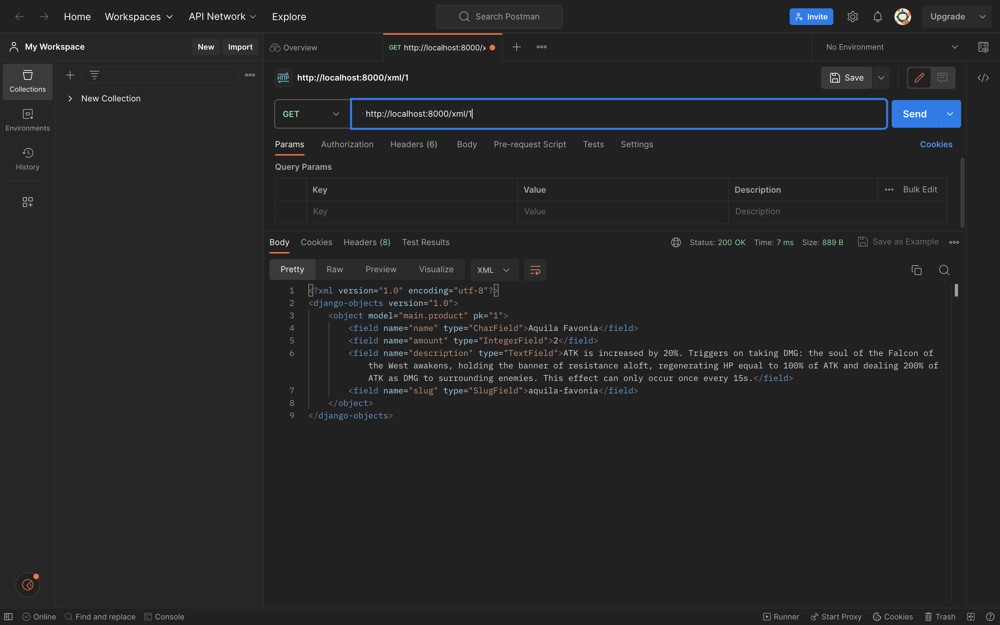
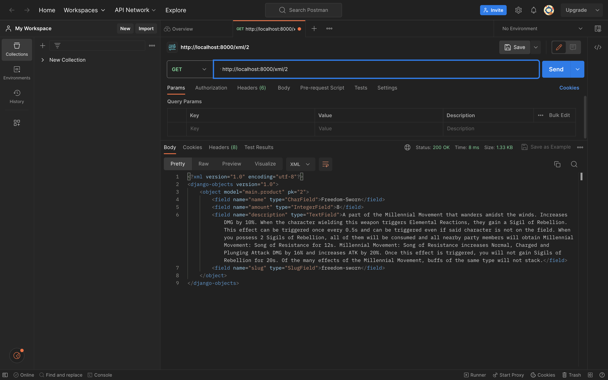
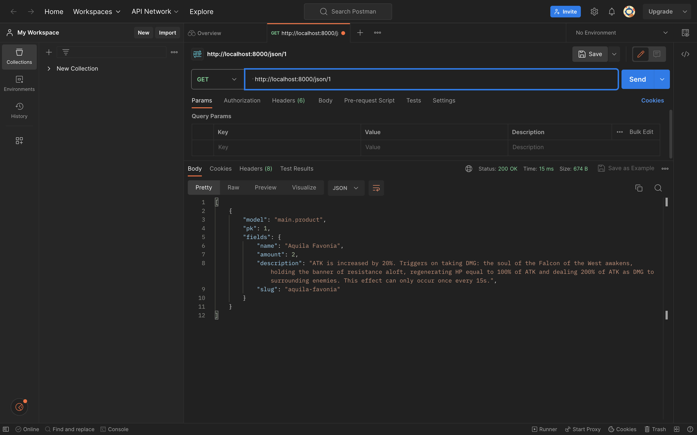
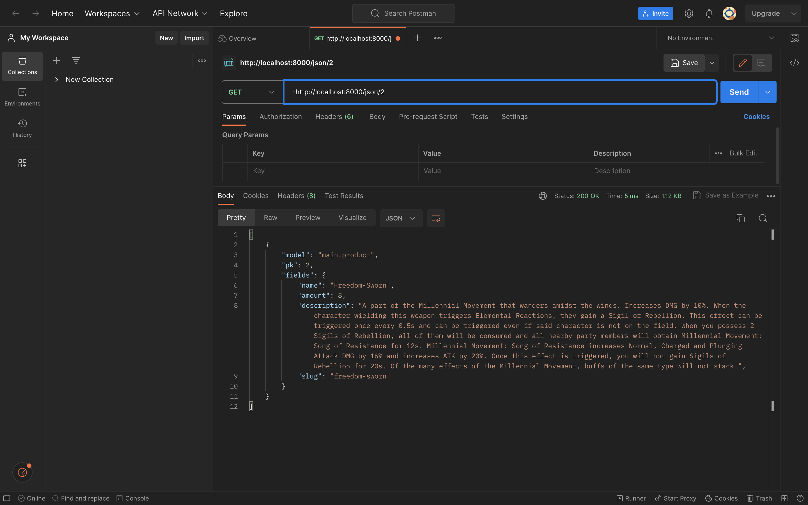
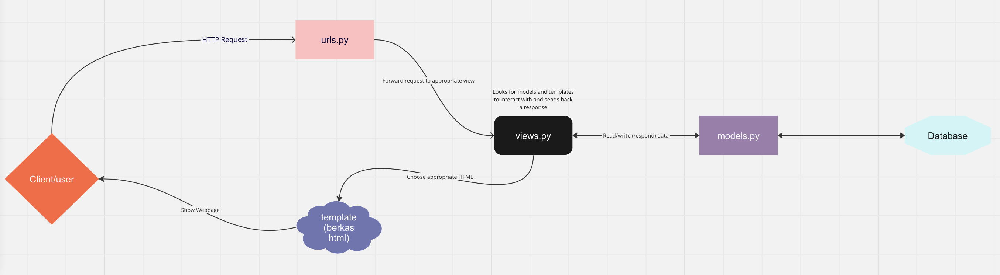

TUGAS 5
1. Jelaskan manfaat dari setiap element selector dan kapan waktu yang tepat untuk menggunakannya.
Jawab:
- Element selector
Manfaat: Memilih semua elemen dengan jenis tertentu.
Waktu yang Tepat: Digunakan saat ingin mengaplikasikan gaya umum ke semua elemen dengan jenis yang sama, seperti mengubah font atau warna teks di seluruh paragraf.

p {
  font-size: 16px;
  color: #333;
}

- ID selector
Manfaat: Memilih elemen dengan atribut id tertentu (harus unik dalam satu halaman).
Waktu yang Tepat: Berguna ketika ingin memberikan gaya khusus atau mengakses elemen tertentu dalam halaman. Biasanya digunakan untuk elemen utama atau unik.

#header {
  background-color: #f0f0f0;
}

- Class selector
Manfaat: Memilih elemen-elemen dengan atribut class tertentu (bisa digunakan oleh beberapa elemen).
Waktu yang Tepat: Berguna saat ingin mengaplikasikan gaya yang sama ke beberapa elemen yang berbagi kelas yang sama, seperti mengatur properti gaya untuk semua tombol dalam satu kelas.

.button {
  background-color: #007bff;
  color: #fff;
}

- Descendant selector
Manfaat: Memilih elemen yang merupakan anak dari elemen lain.
Waktu yang Tepat: Berguna saat ingin mengaplikasikan gaya khusus ke elemen-elemen di dalam elemen lain, seperti mengatur gaya untuk semua paragraf dalam sebuah div.

.container p {
  margin: 10px;
}

- Universal selector
Manfaat: Memilih semua elemen dalam dokumen.
Waktu yang Tepat: Berguna dalam beberapa kasus saat ingin mengaplikasikan gaya dasar ke semua elemen.

* {
  box-sizing: border-box;
}

- Attribute selector
Manfaat: Memilih elemen dengan atribut atau nilai atribut tertentu.
Waktu yang Tepat: Berguna saat ingin memilih elemen berdasarkan atribut mereka, misalnya, memilih semua tautan eksternal dalam dokumen.

a[href^="http"] {
  color: #007bff;
}

2. Jelaskan HTML5 Tag yang kamu ketahui.
Jawab:
- \<!DOCTYPE html>: Ini adalah deklarasi tipe dokumen yang digunakan dalam dokumen HTML5 untuk menunjukkan jenis dokumen HTML yang digunakan.
- \<html>: Ini adalah elemen root dari setiap halaman HTML. Semua elemen HTML lainnya berada di dalamnya.
- \<head>: Ini adalah elemen yang berisi informasi meta-data tentang dokumen HTML, seperti judul halaman, tautan ke stylesheet, dan karakter encoding.
- \<title>: Ini digunakan untuk menentukan judul halaman yang akan ditampilkan di tab atau judul jendela peramban.
- \<meta>: Elemen ini digunakan untuk mengatur karakter encoding dokumen, deskripsi, dan meta-data lainnya yang terkait dengan halaman.
- \<link>: Digunakan untuk menghubungkan dokumen HTML dengan stylesheet eksternal atau ikon favicon.
- \<style>: Elemen ini dapat digunakan untuk menambahkan gaya CSS langsung ke dalam dokumen HTML
- \<script>: Ini adalah elemen yang digunakan untuk memasukkan skrip JavaScript ke dalam dokumen.
- \<body>: Ini adalah elemen yang berisi konten tampilan halaman web, seperti teks, gambar, tautan, formulir, dan elemen-elemen lainnya.
- \<header>: Elemen ini biasanya digunakan untuk mengelompokkan elemen-elemen yang terkait dengan bagian kepala halaman web, seperti logo, judul, dan navigasi.
- \<nav>: Ini digunakan untuk mengelompokkan tautan navigasi utama atau menu.
- \<section>: Ini digunakan untuk mengelompokkan konten yang memiliki konteks atau tema yang sama.
- \<footer>: Ini adalah elemen yang digunakan untuk mengelompokkan konten yang berada di bagian bawah halaman, seperti informasi kontak atau hak cipta.
- \<form>: Digunakan untuk membuat formulir interaktif yang memungkinkan pengguna mengirimkan data ke server.
- \<input>: Elemen ini digunakan dalam formulir untuk menambahkan berbagai jenis input, seperti teks, kata sandi, kotak centang, dan lain-lain.
- \<button>: Ini digunakan untuk membuat tombol yang dapat diklik oleh pengguna.
- \<label>: Digunakan untuk memberikan label atau teks penjelasan untuk elemen input dalam formulir.
- \<textarea>: Digunakan untuk membuat area teks yang lebih besar, seperti kolom komentar dalam formulir.

3. Jelaskan perbedaan antara margin dan padding.
Jawab:

- Margin adalah ruang di luar elemen, antara elemen tersebut dan elemen-elemen lain di sekitarnya atau batas kotak luar elemen tersebut.
Margin tidak memiliki latar belakang atau warna, dan tidak dapat diisi dengan konten atau gaya visual lainnya. Margin mengatur jarak antara elemen dengan elemen lain di sekitarnya, memengaruhi tata letak keseluruhan elemen dalam halaman.

- Padding adalah ruang di dalam elemen, antara konten elemen dan batas kotak dalam elemen tersebut.
Padding dapat memiliki latar belakang dan warna, sehingga Anda dapat mengisi ruang ini dengan warna atau gambar latar belakang.
Padding memengaruhi ruang di dalam elemen, dan tidak memengaruhi jarak antara elemen dengan elemen lainnya. Ini berpengaruh pada tampilan dan tata letak konten dalam elemen.
Anda dapat mengatur padding atas, bawah, kiri, dan kanan secara terpisah menggunakan properti padding-top, padding-bottom, padding-left, dan padding-right.

4. Jelaskan perbedaan antara framework CSS Tailwind dan Bootstrap. Kapan sebaiknya kita menggunakan Bootstrap daripada Tailwind, dan sebaliknya?
Jawab:
Dari segi desain
- Bootstrap menawarkan set class CSS dan komponen yang telah dirancang sebelumnya dengan tampilan yang cukup terstruktur dan konsisten. Ini cocok untuk proyek dengan desain tradisional yang membutuhkan kerangka kerja yang stabil dan mudah digunakan.

- Tailwind menganut pendekatan yang lebih "utility-first", di mana kita membangun antarmuka dengan menggabungkan class utilitas yang lebih kecil. Ini memberikan kebebasan kreatif yang lebih besar dan memungkinkan penggunaan class yang sangat spesifik.

Dari segi fleksibilitas
- Bootstrap menawarkan kerangka kerja yang relatif terstruktur dengan banyak komponen yang telah dirancang sebelumnya. Ini memberikan stabilitas dan kemudahan penggunaan, tetapi mungkin memiliki batasan dalam hal fleksibilitas desain yang unik.

- Tailwind memberikan fleksibilitas yang lebih besar dengan pendekatan "utility-first" yang memungkinkan kita membangun desain yang sangat kustom sesuai kebutuhan. kita memiliki kendali penuh atas gaya dan tata letak dengan kombinasi class utilitas yang spesifik.

Dari ukuran file
- Bootstrap adalah kerangka kerja yang lebih besar dalam hal ukuran file karena menyediakan banyak fitur dan komponen yang siap pakai. Ini mungkin berdampak pada kecepatan pengunduhan dan performa halaman web.

- Tailwind dirancang untuk lebih ringan dalam hal ukuran file. Namun, ketika kita menggunakan banyak class utilitas dalam kode, ukuran file CSS dapat meningkat.

Dari ekosistem pengembangan
- Bootstrap memiliki ekosistem yang sangat kuat dengan dokumentasi yang kaya, banyak tema dan template yang tersedia, serta dukungan komunitas yang luas. Ini membuatnya mudah untuk memulai dan mendapatkan sumber daya yang diperlukan.

- Tailwind juga memiliki ekosistem yang berkembang pesat dengan dokumentasi yang baik dan komunitas yang aktif, kita dapat menemukan banyak sumber daya, plugin, dan integrasi dengan kerangka kerja JavaScript seperti React atau Vue.

Gunakan Bootstrap jika:
- Menginginkan desain yang relatif baku dan konsisten secara visual di seluruh proyek.
- Memerlukan komponen siap pakai dengan gaya dan tata letak yang sudah ditentukan.
- Ingin cepat membangun prototipe atau proyek dengan usaha desain minimal.

Gunakan Tailwind CSS jika:
- Ingin kendali yang lebih besar atas desain dan ingin membangun tampilan yang sangat khusus.
- Ingin menghindari "overhead" dari komponen siap pakai yang mungkin tidak digunakan sepenuhnya.
- Siap untuk belajar dan menggabungkan kelas-kelas utilitas kecil untuk mencapai desain yang diinginkan.

5. Jelaskan bagaimana cara kamu mengimplementasikan checklist di atas secara step-by-step (bukan hanya sekadar mengikuti tutorial).
Jawab:
Menurut saya untuk mengimplementasikan CSS pada HTML tidak bisa hanya bergantung kepada tutorial karena ada banyak sekali hal-hal mengenai CSS diluar sana yang tidak ada di tutorial. Jadi saya, mengikuti tutorial untuk menambahkan Bootstrap ke aplikasi, setelah itu saya meembaca dokumentasi-dokumentasi yang ada di https://getbootstrap.com/docs/5.0/getting-started/introduction/ kemudian saya juga mencari inspirasi color palette untuk desain saya di https://colorhunt.co selain itu saya juga mempelajari cara menambahkan font dari https://youtu.be/iIqgW-stZmE?si=CSGblmKAqvDYwz6N saya juga mempelajari Bootstrap grid https://getbootstrap.com/docs/4.0/layout/grid/ dan kemudian melakukan adjustment terhadap desain saya

TUGAS 4
1. Apa itu Django UserCreationForm, dan jelaskan apa kelebihan dan kekurangannya?
Jawab:
UserCreationForm adalah impor formulir bawaan yang memudahkan pembuatan formulir pendaftaran pengguna dalam aplikasi web. Dengan formulir ini, pengguna baru dapat mendaftar dengan mudah di situs web Anda tanpa harus menulis kode dari awal.

Kelebihan:
- Mudah digunakan dan cepat diimplementasikan.
- Validasi otomatis untuk mengurangi kesalahan input.
- Dukungan untuk integrasi dengan sistem otentikasi Open Authorization.
- Fleksibilitas untuk penyesuaian tampilan dan perilaku.

Kekurangan:
- Keterbatasan kustomisasi untuk proyek yang lebih kompleks.
- Bergantung pada model User bawaan Django.
- Tampilan bawaan mungkin memerlukan penyesuaian desain.
- Mungkin memerlukan penyesuaian tambahan untuk UI atau logika bisnis yang kompleks.

2. Apa perbedaan antara autentikasi dan otorisasi dalam konteks Django, dan mengapa keduanya penting?
Jawab:
Autentikasi di Django adalah proses verifikasi identitas pengguna, memastikan bahwa mereka adalah siapa yang mereka klaim. Sementara otorisasi adalah tentang mengendalikan izin akses pengguna terhadap berbagai sumber daya dan fitur dalam aplikasi. Autentikasi melindungi akun pengguna, sementara otorisasi melindungi data dan fitur dari akses yang tidak diizinkan. Kedua konsep ini bersama-sama menciptakan sistem keamanan yang kokoh dalam aplikasi Django, memastikan bahwa hanya pengguna yang sah dengan izin yang sesuai yang dapat mengakses dan berinteraksi dengan sumber daya aplikasi.

3. Apa itu cookies dalam konteks aplikasi web, dan bagaimana Django menggunakan cookies untuk mengelola data sesi pengguna?
Jawab:
Cookie HTTP (juga disebut cookie web, cookie Internet, cookie browser, atau cookie sederhana) adalah sepotong kecil data yang dikirim dari situs web dan disimpan di komputer pengguna oleh browser web pengguna saat pengguna berselancar.

Teknologi ini dirancang untuk menjadi mekanisme andal bagi situs web untuk mengingat informasi stateful (seperti barang yang ditambahkan dalam keranjang belanja di toko online) atau untuk merekam aktivitas penelusuran pengguna.

Mereka juga dapat digunakan untuk mengingat potongan informasi dan data yang sebelumnya dimasukkan pengguna ke dalam bidang formulir seperti nama, alamat, kata sandi, dan nomor kartu kredit.

Sebuah situs biasanya akan memberikan notifikasi terkait penggunaan cookie ketika pengguna baru mengunjungi web tersebut. Pengguna bisa mengelola cookie sesuai dengan keinginannya melalui pengaturan browser.

Berikut adalah beberapa kegunaan & fungsi cookies :
- Menyimpan informasi login
- Menyimpan pengaturan website
- Menyediakan konten lebih personal
- Menampilkan iklan
  
Langkah-langkah Django menggunakan cookies untuk mengelola sesi pengguna:
- Konfigurasi Settings: Pada settings.py, pastikan 'django.contrib.sessions.middleware.SessionMiddleware' sudah ada dalam daftar middleware.
- Cookies Sesi: Ketika pengguna pertama kali mengunjungi situs web Django Anda, server akan menghasilkan cookie sesi khusus yang akan dikirim ke peramban pengguna. Cookie ini berisi identifikasi unik sesi pengguna, biasanya berupa string panjang.
- Penyimpanan Data Sesi: Data sesi pengguna sebenarnya disimpan di sisi server, biasanya dalam database atau dalam penyimpanan cache yang dapat dikonfigurasi. Django memiliki pengaturan untuk mengonfigurasi penyimpanan sesi.
- Penggunaan Cookies: Setiap kali pengguna membuat permintaan selanjutnya ke server, cookie sesi akan dikirim bersama permintaan. Server kemudian akan mengidentifikasi sesi pengguna berdasarkan nilai unik dalam cookie tersebut.
- Mengakses Data Sesi: Kita dapat mengakses dan memanipulasi data sesi pengguna dengan mudah di tampilan Django menggunakan objek request.session. Ini adalah cara yang aman untuk menyimpan data sesi pengguna karena data sesi sebenarnya tidak ada di sisi klien.
- Kadaluwarsa Sesi: Django akan mengatur masa berlaku sesi secara otomatis. Kita dapat mengkonfigurasi berapa lama sesi akan berlangsung dengan mengatur SESSION_COOKIE_AGE dalam pengaturan (settings.py).

4. Apakah penggunaan cookies aman secara default dalam pengembangan web, atau apakah ada risiko potensial yang harus diwaspadai?
Jawab:
Penggunaan cookies dalam pengembangan web bisa aman, tetapi ada risiko yang perlu diwaspadai. Berikut adalah beberapa risiko potensial yang perlu diwaspadai saat menggunakan cookies:
- Pelanggaran Privasi: Cookies dapat digunakan untuk melacak perilaku pengguna di situs web, dan jika data pribadi atau sensitif disimpan dalam cookies, ada potensi pelanggaran privasi. Oleh karena itu, sangat penting untuk melindungi data pribadi pengguna dan hanya menyimpan data yang diperlukan.
- Cross-Site Scripting (XSS): Jika cookies digunakan untuk menyimpan data yang diambil dari input pengguna tanpa penyaringan yang tepat, maka aplikasi Anda dapat rentan terhadap serangan XSS. Dalam serangan XSS, penyerang dapat mencoba mencuri cookies pengguna atau menjalankan kode berbahaya di perangkat pengguna.
- Session Hijacking: Cookies yang digunakan untuk mengidentifikasi sesi pengguna (session cookies) harus dijaga dengan baik. Jika sesi pengguna dapat diambil alih (hijacked), penyerang dapat mengakses akun pengguna tanpa izin.
- Cookies yang Tidak Aman: Pengaturan cookie yang tidak aman, seperti mengizinkan cookie berjalan melalui HTTP tanpa enkripsi SSL/TLS, dapat membuka peluang bagi penyerang untuk mengambil alih atau mencuri cookies.
- Penyimpanan Berlebihan: Penyimpanan berlebihan atau penggunaan cookies yang tidak perlu dapat memperlambat kinerja situs web dan membebani pengguna.

5. Jelaskan bagaimana cara kamu mengimplementasikan checklist di atas secara step-by-step (bukan hanya sekadar mengikuti tutorial).
Jawab:
Saya membaca dan mempelajari tutorial 3 lalu sayaa juga mencari tahu lebih lanjut tentang register, login dan logout dan membaca laman web https://ordinarycoders.com/blog/article/django-user-register-login-logout, kemudian saya juga membaca penjelasan-penjelasan tentaang Cookies dan Session https://www.dcs.gla.ac.uk/~leif/di/tutorial/cookie.html, emudian barulah saya mengimplementasikannya pada tugas 4 PBP ini.

   
TUGAS 3
1. Apa perbedaan antara form POST dan form GET dalam Django?
   POST akan mengirimkan data/nilai langsung ke file lain untuk ditampung tanpa menampilkan pada URL (umumnya digunakan untuk mengirimkan data penting seperti password dan data pribadi), sementara GET akan menampilkan data/nilai pada URL, kemudian ditampung oleh file lain
   
2. Apa perbedaan utama antara XML, JSON, dan HTML dalam konteks pengiriman data?
- XML adalah adalah bahasa markup yang digunakan untuk mendefinisikan struktur data secara hierarkis. XML sering digunakan untuk pertukaran data antara aplikasi dan sistem yang berbeda, terutama dalam lingkungan yang lebih kompleks seperti aplikasi bisnis dan web services.
  
- JSON adalah format pertukaran data ringan yang terinspirasi oleh sintaksis objek JavaScript. SON lebih mudah dibaca oleh manusia daripada XML karena memiliki sintaksis yang lebih sederhana dan mirip dengan bahasa pemrograman.
  
- HTML adalah bahasa markup yang digunakan untuk membuat halaman web dan menampilkan konten di browser web. HTML memiliki sejumlah elemen bawaan yang digunakan untuk mendefinisikan struktur konten, seperti paragraf, heading, daftar, tabel, dan lainnya. 

Perbedaan utama ketiganya : XML digunakan untuk mendefinisikan struktur data dan pertukaran data antar aplikasi. JSON digunakan untuk pertukaran data ringan antar aplikasi, terutama di lingkungan web. Sementara HTML digunakan untuk membuat tampilan dan konten halaman web yang dapat diakses oleh pengguna melalui browser.

3. Mengapa JSON sering digunakan dalam pertukaran data antara aplikasi web modern?
   JSON sering digunakan dalam pertukaran data antara aplikasi web modern karena memiliki banyak kelebihan sebagai berikut:
   - JSON memiliki format teks yang sederhana, yang membuatnya mudah dibaca oleh manusia dan mudah dipahami oleh mesin.
   - JSON mendukung berbagai jenis data, termasuk objek dan array, sehingga dapat digunakan untuk merepresentasikan data yang kompleks.
   - Dalam aplikasi web modern, seringkali hanya sebagian kecil data yang perlu diperbarui, bukan seluruh halaman. JSON memungkinkan pembaruan parsial dengan mudah, yang membantu mengurangi beban server dan meningkatkan responsivitas aplikasi.
   - JSON tidak hanya digunakan dalam lingkungan JavaScript, tetapi juga dapat diakses dan dimengerti oleh banyak bahasa pemrograman lainnya.

4. Jelaskan bagaimana cara kamu mengimplementasikan checklist di atas secara step-by-step (bukan hanya sekadar mengikuti tutorial).
   - Membuat input form untuk menambahkan objek model pada app sebelumnya.
   Jawab:
   Saya membaca dan memahami materi yang ada pada tutorial kemudian saya juga mempelajari mengenai form dari https://docs.djangoproject.com/en/4.2/topics/forms/ kemudian setelah saya mengerti, baru saya tambahkan pada projek tugas saya

   - Tambahkan 5 fungsi views untuk melihat objek yang sudah ditambahkan dalam format HTML, XML, JSON, XML by ID, dan JSON by ID.
   Jawab:
   Saya membaca dan memahami materi yang ada pada tutorial kemudian saya juga mempelajari mengenai form dari https://docs.djangoproject.com/en/4.2/topics/http/views/ kemudian setelah saya mengerti, baru saya tambahkan pada projek tugas saya

   - Membuat routing URL untuk masing-masing views yang telah ditambahkan pada poin 2.
   Jawab:
   Saya membaca dan memahami materi yang ada pada tutorial kemudian saya juga mempelajari mengenai form dari https://docs.djangoproject.com/en/4.2/topics/http/urls/ kemudian setelah saya mengerti, baru saya tambahkan pada projek tugas saya

5. Screenshot Postman
   
   
   
   
   
   
   
   
TUGAS 2
1. Jelaskan bagaimana cara kamu mengimplementasikan checklist di atas secara step-by-step (bukan hanya sekadar mengikuti tutorial).
Jawab:
Saya membaca dan memahami terlebih dahulu berkas tutorial, saya juga mencari tahu hubungan antara tiap file pada project Django (seperti urls.py, view.py, models.py, dll.), kemudian baru saya mengimplementasikan apa yang sudah saya pelajari ke dalam aplikasi Inventory ini untuk Tugas 2 PBP

2. Buatlah bagan yang berisi request client ke web aplikasi berbasis Django beserta responnya dan jelaskan pada bagan tersebut kaitan antara urls.py, views.py, models.py, dan berkas html. 
Jawab:

- Client mengirimkan permintaan HTTP ke server Django
- urls.py (routing)
   Permintaan dari client masuk ke dalam berkas urls.py dan kemudian URL yang diterima dihubungkan dengan fungsi tampilan yang sesuai
- view.py (controller)
   Pada file views.py berisi logika aplikasi untuk memproses permintaan. Fungsi views ini berinteraksi dengan models.py untuk memodifikasi data dalam database
- models.py (Model)
   Pada models.py terdapat struktur data aplikasi dan tersedia metode untuk berinteraksi dengan database.
- HTML (template)
   Jika berupa respon, File HTML akan di-render sebagai tampilan yang akan diberikan kepada client.

3. Jelaskan mengapa kita menggunakan virtual environment? Apakah kita tetap dapat membuat aplikasi web berbasis Django tanpa menggunakan virtual environment?
Jawab:
Virtual environment adalah sebuah tool untuk membuat suatu lingkungan virtual untuk project python yang terisolasi dari project lainnya. Misalnya kita mempunyai 2 project python dan masing-masing membutuhkan suatu paket yang sama dengan versi yang berbeda. Kita dapat membuat aplikasi Django tanpa menggunakan virtualenv tetapi dengan memakai virtual environment, kita bisa mengisolasi environment development kita dan menginstall paket yang dibutuhkan suatu project tanpa bentrok dengan project lainnya.

4. Jelaskan apakah itu MVC, MVT, MVVM dan perbedaan dari ketiganya.
Jawab:
- MVC (Model-View-Controller) 
    Model -> Berisi logika bisnis & status data yang ada dalam aplikasi. Bertugas mendapatkan dan memanipulasi data, berkomunikasi dengan Controller dan database, dll.

    View -> Tampilan grafis dari data yang diberikan oleh Model. View bekerja sama dengan Controller untuk menciptakan tampilan dinamis pada aplikasi.

    Controller -> Komunikasi antara View dan Model. Menangani inpuy pengguna, memproses permintaan, dll.

- MVT (Model-View-Template)
    Model -> Sama seperti Model pada MVC

    View -> Tampilan yang menggambarkan data dari Model, tetapi dalam konteks Django, View dalam MVT lebih mirip Controller pada MVC

    Template -> Tampilan HTML yang memiliki kode template Django yang digunakan untuk mengisi kontennya dengan data dari Model. Mirip View pada MVC.

- MVVM (Model-View-ViewModel)
    Model -> Sama seperti MVC dan MVT

    View -> Antarmuka grafis antara penggunaa & pola desain serta menampilkan output dari data yang telah diproses.

    ViewModel -> Berisi logika bisnis serta tampilan data yang akan ditampilkan View. Menghubungkan Model dengan View.

    Perbedaan antara ketiganya : MVC adalah pola desain yang lebih umum & fleksibel, MVT modifikasi MVC yang menggunakan template Django, sementara MVVM adalah pola desain yang lebih fokus kepada UI yang kompleks dan menggunakan ukuran kode yang besar.